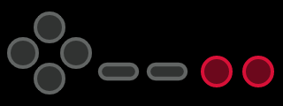
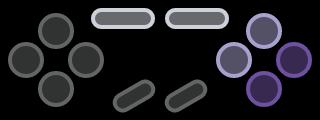
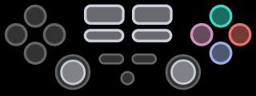
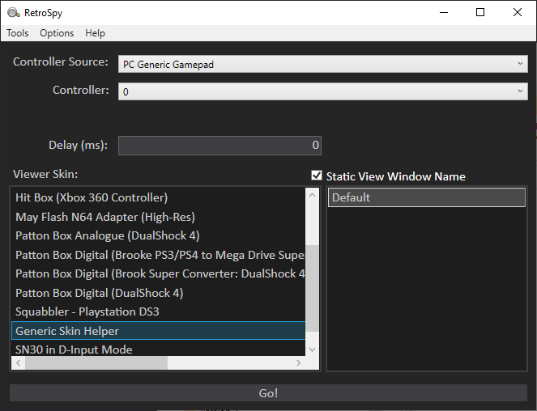
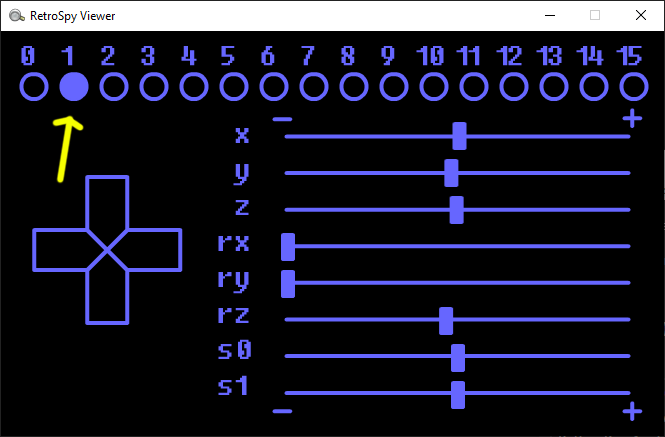
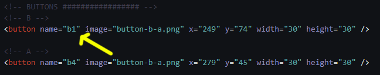
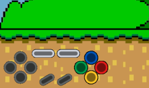
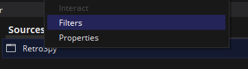
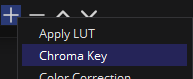
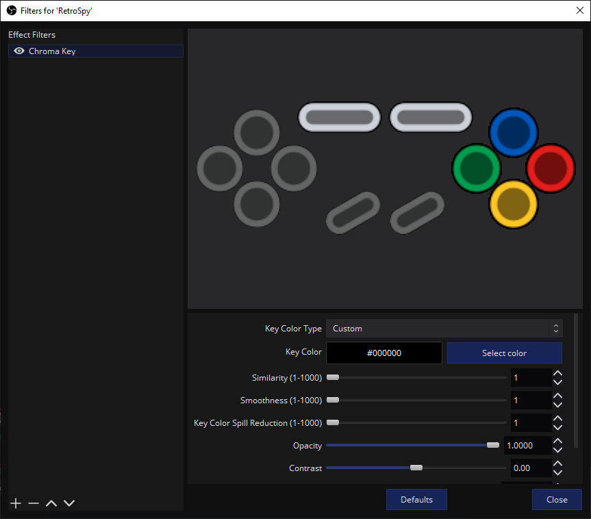

# RetroSpy / NintendoSpy Skins by Squabbler

### [Download the latest Squabbler skins](https://github.com/developwisely/squabbler-retrospy-nintendospy-skins/releases/latest)

This contains a various list of skins created by Squabbler for use with RetroSpy or NintendoSpy. All skins have a consistent theme with the controller it is emulating for easy recognition.

## Skins Included In Latest Version

#### NES (types: nes, generic, MiSTer)

#### SNES (types: snes, generic, MiSTer)

#### Super Famicom (types: snes, generic, MiSTer)

#### DualShock 3 (types: generic, MiSTer)

## Installation

Simply drop the skins from the zip into the skins folder inside the RetroSpy/NintendoSpy folder you have. 

*Note that there is a separate folder for MiSTer skins that needs to be added to the skins/MiSTer folder inside of RetroSpy.*

## FAQs

### What is RetroSpy?

A fork of NintendoSpy, RetroSpy is designed to present controller inputs from a console or computer in a display window. This allows you to show your controller inputs for things like speedrunning, game tutorials, and more. You can also convert controller presses into keystrokes to control programs on your computer such as LiveSplit and OBS.

#### [For more information or to download RetroSpy, see the GitHub page.](https://github.com/retrospy/RetroSpy)

---

### My Buttons Are Wrong!

Sometimes, a controller might be mapped differently compared to what the skin has mapped.  

In order to fix this, follow these steps:

| Step | Example |
| :----------- | :----------- |
| 1. Open RetroSpy | |
| 2. Run the "helper" skin for the category/type you are using (generic, MiSTer, etc) |  |
| 3. When you press buttons, you will see what value that buttons correlates to |  ||
| 4. Open the skin folder of the skin you want to fix | |
| 5. Open the skin.xml file in a text editor | |
| 6. Change the respective button name to match the output you are seeing in the helper |  |
| 7. Save the file | |
| 8. Restart RetroSpy | |

---

### How To Chroma In OBS

Using Chroma filter in OBS will remove the black background on the skin, and allow the buttons to float on top of whatever background you want.

Example of the buttons on the corner of the game view

| Step | Example |
| :----------- | :----------- |
| 1. Right-click RetroSpy in OBS and select Filters |  |
| 2. Add a new Chroma Key filter using the bottom left plus (+) |  |
| 3. Click the Default button, this will reset all settings to green chroma | |
| 4. Use the following settings: |  |